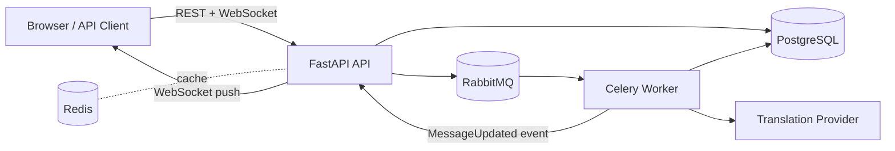
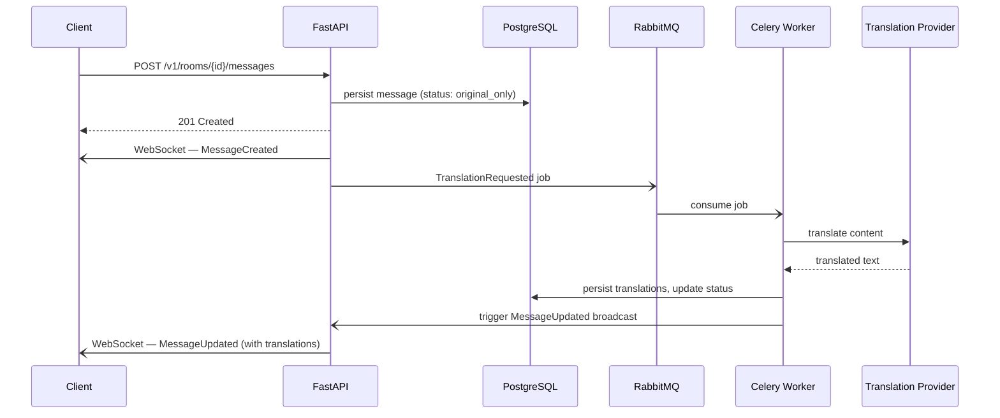

# Prism

Prism is a real-time chat platform where messages are automatically translated server-side so every participant reads the conversation in their own language — without any delay to the sender.

When a message is sent, it is delivered immediately to all connected clients. Translation runs asynchronously in the background and is pushed to every client as a live update the moment it completes. If the translation provider is unavailable, the message stays readable in the original language and the status is surfaced to the UI — the chat never blocks.


> When the LLM provider is unavailable, the message is still delivered in the original language and the translation status is shown.
>
> 

---

## Architecture



## Message flow



**When the translation provider is unavailable:** steps 1–5 still execute — the message is delivered in the original language. The worker retries, then marks the message `translation_unavailable` and pushes a status update. Chat is never blocked.

The API and worker are fully decoupled. The worker only writes to Postgres and fires an update event back through the gateway. The translation model can be swapped via config without touching application logic.

---

## Stack

| Layer | Technology |
|---|---|
| API + WebSocket | FastAPI (Python 3.12) |
| Task queue | Celery + RabbitMQ |
| Session / pub-sub | Redis |
| Database | PostgreSQL + Alembic |
| Containerisation | Docker Compose |

---

## Quick start

> Secrets stay local. The repo tracks only `.env.example` — copy it to `.env` and never commit the result.

**1. Create your local env file**

```bash
cp .env.example .env
```

**2. Set your translation provider in `.env`**

```env
TRANSLATION_PROVIDER=openai
TRANSLATION_MODEL=gpt-4.1-mini
TRANSLATION_FALLBACK_PROVIDER=openai
TRANSLATION_FALLBACK_MODEL=gpt-4.1-mini
OPENAI_API_KEY=your_key_here
```

> If port 8000 is already in use, set `API_PORT` in `.env` to a free port (e.g. `8010`).

**3. Start all services**

```bash
docker compose -f deploy/compose/docker-compose.yml up --build
```

**4. Run database migrations** (in a separate shell)

```bash
docker compose -f deploy/compose/docker-compose.yml run --rm api alembic -c migrations/alembic.ini upgrade head
```

**5. Open the dashboard**

Navigate to `http://localhost:8000/ui` — create rooms, add users, send messages, and watch translations arrive live.

**6. Verify the API**

```bash
curl http://localhost:8000/v1/health
```

---

## Docker command reference

| What | Command |
|---|---|
| Start (foreground) | `docker compose -f deploy/compose/docker-compose.yml up --build` |
| Start (detached) | `docker compose -f deploy/compose/docker-compose.yml up --build -d` |
| Stop | `docker compose -f deploy/compose/docker-compose.yml down` |
| Stop + wipe volumes | `docker compose -f deploy/compose/docker-compose.yml down -v` |
| Run migrations | `docker compose -f deploy/compose/docker-compose.yml run --rm api alembic -c migrations/alembic.ini upgrade head` |
| Run tests | `docker compose -f deploy/compose/docker-compose.yml run --rm tests` |
| API logs | `docker compose -f deploy/compose/docker-compose.yml logs -f api` |
| Worker logs | `docker compose -f deploy/compose/docker-compose.yml logs -f worker` |

**Creating a new migration after schema changes:**

```bash
docker compose -f deploy/compose/docker-compose.yml run --rm api \
  alembic -c migrations/alembic.ini revision --autogenerate -m "describe_change"
docker compose -f deploy/compose/docker-compose.yml run --rm api \
  alembic -c migrations/alembic.ini upgrade head
```

---

## Running tests

```bash
# Docker (recommended)
docker compose -f deploy/compose/docker-compose.yml run --rm tests

# Local
pip install -r requirements.txt
pytest -q tests/unit
```

---

## Project status

**Working now:**
- Room creation and membership management
- User profiles with per-user language preferences
- Message send, persistence, and WebSocket fan-out to all room subscribers
- Async translation via configurable LLM provider with live `MessageUpdated` push
- Graceful degradation — provider failures mark the message `translation_unavailable` and push a status update without breaking chat
- Reconnect-safe room history replay
- Docker-first local dev with Postgres, RabbitMQ, Redis, API, and worker

**Planned / not yet built:**
- Redis pub/sub fan-out across multiple API replicas (currently single-instance only)
- Admin analytics and room metrics dashboards (telemetry schema is in place, aggregation and API are not)
- Structured observability — correlation IDs, request tracing across API and worker
- Production hardening — rate limiting and quota enforcement
- Seed / dev bootstrap script for quick local QA setup

---

## Use this as a starting point

This project is a working foundation for anyone building a real-time multilingual chat system. The core architecture — async translation via a decoupled worker, live WebSocket updates, and graceful provider degradation — is implemented and tested.

If you want to build on it, the natural next steps are listed above under *Planned*. Everything is Docker-first, the service boundaries are clean, and the worker's translation provider is fully abstracted behind a config-driven interface — so swapping models or providers requires no code changes.

Pull requests and forks are welcome. If you extend it in an interesting direction, feel free to open an issue to share what you built.


