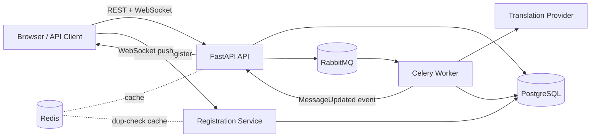

# Architecture Overview

## Design Goals

- Deliver original messages immediately — translation never blocks chat responsiveness.
- Perform translation server-side for consistent output and shared cost across all recipients.
- Support room-based conversations with per-room configurable translation quality.
- Persist the complete message timeline including all translation updates.
- Maintain chat functionality during provider outages through graceful degradation.

---

## High-Level Architecture

---

## Runtime Topology

| Container | Role |
|---|---|
| `api` | FastAPI REST endpoints, WebSocket gateway, browser dashboard |
| `worker` | Celery consumer for translation jobs |
| `registration` | Standalone FastAPI service for account sign-up (email/username/password) |
| `postgres` | Durable store for rooms, members, messages, translations, events, and registration accounts |
| `rabbitmq` | Translation job queue with dead-letter support |
| `redis` | Translation result cache, registration duplicate-check cache; multi-instance pub/sub fanout is not yet implemented |

---

## State Ownership

| Store | Role |
|---|---|
| **PostgreSQL** | Canonical source of truth for all rooms, memberships, messages, translations, and events |
| **Redis** | Auxiliary cache for translation results and short-lived operational keys — not the authoritative store for any domain entity |

---

## Core Pattern

Event-driven enrichment with a live room timeline:

1. Message is accepted and persisted as original content.
2. Original content is broadcast immediately to all room subscribers via WebSocket.
3. A translation job is queued for each target language derived from room member preferences.
4. Worker translates, persists results, and broadcasts a `MessageUpdated` event with the same `message_id`.
5. Clients patch the message in place — the timeline never resets.
6. Reconnect-safe history replay ensures clients that rejoin see recent messages.

---

## Degraded Mode

When the translation provider is unavailable:

- `MessageCreated` emission is never blocked — original delivery always goes through.
- The worker retries according to the retry policy, then marks the message `translation_unavailable`.
- A `MessageUpdated` event with that status is still broadcast so clients can surface it.
- Translation is best-effort enrichment on top of guaranteed original-message delivery.

---

## Delivery Semantics

| Concept | Behavior |
|---|---|
| Message identity | Stable `message_id` across the original broadcast and all translation updates |
| Versioning | Monotonically incrementing `version` on every server-side update |
| Realtime stream | Fan-out to all currently connected room subscribers |
| History replay | Room history endpoint with cursor-safe replay for reconnecting clients |

---

## Translation Quality Modes

Room admins can configure translation quality per room:

| Mode | Trade-off |
|---|---|
| `low_latency` | Faster, lighter model — prioritises speed |
| `balanced` | Default — good quality at reasonable latency |
| `high_quality` | Slower, more capable model — prioritises accuracy |

Mode influences the prompt profile, model selection, timeout, retry policy, and batching behavior.

---

## Identity Model

User identity is split across two tables linked by a shared primary key, not merged into one:

| Table | Owns | Written by |
|---|---|---|
| `public.users` | `display_name`, `preferred_lang` — referenced by rooms, memberships, messages | API (profile updates), registration service (on sign-up) |
| `auth.accounts` | `email`, `username`, `password_hash` — sign-up credentials only | Registration service |

`auth.accounts.id` is a foreign key to `users.id` (`ondelete=CASCADE`). Registration creates both rows in a single transaction. Rationale:

- **Isolation**: credentials live in a dedicated `auth` schema that can be access-controlled separately from general chat data.
- **Write/read volume**: a user registers once but sends many messages — keeping credentials in a small, rarely-touched table avoids bloating or contending with the high-traffic `users`/`messages` tables.
- **Stable identity**: `users.id` remains the single id referenced by rooms and messages no matter how auth storage evolves later.

---

## Analytics Model *(pending)*

The telemetry schema is in place. Aggregation jobs, API endpoints, and the dashboard are follow-on work.

Planned metrics:
- Translation cost by room and time window
- End-to-end translation delay percentiles
- Queue delay and worker processing time
- Translation success, failure, and retry rates
- Per-language-pair volume and cost breakdown
