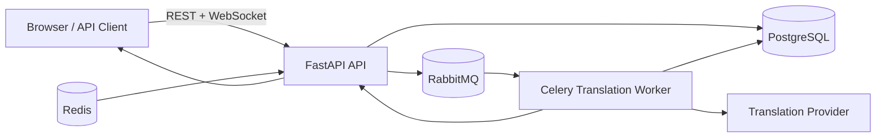

# Architecture Overview

## Design Goals

- Deliver original messages immediately — translation never blocks chat responsiveness.
- Perform translation server-side for consistent output and shared cost across recipients.
- Support room-based conversations with per-room configurable translation quality.
- Persist the complete message timeline including all translation updates.
- Maintain chat functionality during provider outages through graceful degradation.

## High-Level Architecture

## Runtime Topology

| Container | Role |
|---|---|
| `api` | FastAPI REST endpoints, WebSocket gateway, browser dashboard |
| `worker` | Celery consumer for translation jobs |
| `postgres` | Durable store for rooms, members, messages, translations, and events |
| `rabbitmq` | Translation job queue with dead-letter support |
| `redis` | Translation result cache; pub/sub fanout for multi-instance is not yet implemented |

## State Ownership

- **PostgreSQL** is the canonical source of truth for all rooms, memberships, messages, translations, and events.
- **Redis** is an auxiliary cache for translation results and short-lived operational keys. It is not the authoritative store for any domain entity.

## Core Architectural Pattern

Event-driven enrichment with a live room timeline:

1. Message is accepted and persisted as original content.
2. Original content is broadcast immediately to room subscribers.
3. Translation jobs are queued for the target-language workflow.
4. Worker computes the required target languages and performs provider translation.
5. Translation rows are persisted and a MessageUpdated event is broadcast for the same message id.
6. The room timeline remains live even when translation is delayed or unavailable.
7. Clients can load recent room history and reconnect with a cursor-safe replay window when they re-enter a room.

The current slice includes reconnect-safe room history for recent messages, while full analytics and multi-instance fanout remain follow-on work.

## Degraded Mode Behavior (LLM Unavailable)

- MessageCreated emission is never blocked by translation availability.
- If translation provider calls fail or time out, chat still delivers and persists the original message.
- Worker records translation failure status and may emit a non-blocking message update indicating translation_unavailable.
- Clients must treat translation as best-effort enrichment on top of guaranteed original-message delivery.

## Delivery Semantics

- **Realtime stream:** live room fan-out to all currently connected clients.
- **Message identity:** stable `message_id` across the original broadcast and all subsequent translation updates.
- **Versioning:** monotonically incrementing `version` on every server-side message update.
- **History replay:** room history endpoint returns recent messages for reconnect-safe replay.

## Room Configuration Model

Room admins can configure translation mode:

- low_latency
- balanced
- high_quality

Mode influences prompt profile, model choice, timeout, retry policy, and batching behavior.

## Room Admin Metrics Model

> **Status: Pending.** The telemetry schema is in place; the aggregation jobs, API, and dashboard are follow-on work.

Planned tracked metrics:

- Translation cost by room and time window
- End-to-end translation delay percentiles
- Queue delay and worker processing time
- Translation success, failure, and retry rates
- Per-language-pair volume and cost breakdown
