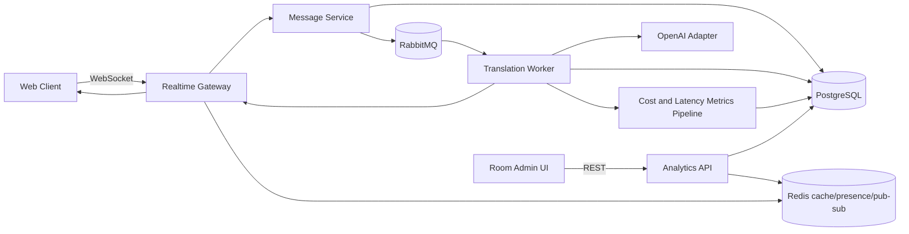

# Architecture Overview

## Objectives

- Preserve chat responsiveness by delivering original messages immediately.
- Perform translation on the server to reduce LLM usage and ensure consistent output per language.
- Support room-based conversations with configurable translation strategy.
- Persist complete message history, including translation updates.
- Preserve core chat functionality during LLM/provider outages by continuing original-message delivery.

## High-Level Architecture

## Runtime Topology

- API container: FastAPI REST + WebSocket gateway.
- Worker container: async consumer for translation jobs.
- Database container: PostgreSQL for durable state and history.
- Queue container: RabbitMQ for durable translation jobs.
- Redis container: cache, presence, cross-instance pub/sub fanout, and rate-limit counters.

## State Ownership

- PostgreSQL is the source of truth for rooms, membership, messages, and translations.
- Redis, when enabled, stores only derived or ephemeral data (cache and presence).
- Redis is not canonical storage; it accelerates read paths and realtime coordination.

## Redis Responsibilities

- Presence tracking with heartbeat-driven TTL updates.
- Read-through cache for room metadata and member language preferences.
- Pub-sub relay for websocket fanout across API replicas.
- Short-lived translation cache to reduce repeated LLM calls.
- Request and event dedup TTL keys.
- Rate-limiting counters for abuse protection.

## Core Architectural Pattern

Event-driven, eventually consistent enrichment:

1. Message is accepted and persisted as original content.
2. Original content is broadcast immediately.
3. Translation jobs are queued.
4. Worker computes required target languages and performs LLM translation.
5. Translation patches are persisted and broadcast as updates to the same message id.
6. Cost and delay metrics are emitted per translation and aggregated for room admin dashboards.

## Degraded Mode Behavior (LLM Unavailable)

- MessageCreated emission is never blocked by translation availability.
- If translation provider calls fail or time out, chat still delivers and persists the original message.
- Worker records translation failure status and may emit a non-blocking message update indicating translation_unavailable.
- Clients must treat translation as best-effort enrichment on top of guaranteed original-message delivery.

## Delivery Semantics

- Realtime stream: at-least-once delivery, client-side deduplication by event id.
- Message identity: stable message id across all updates.
- Versioning: monotonic message version increment on every server-side update.

## Room Configuration Model

Room admins can configure translation mode:

- low_latency
- balanced
- high_quality

Mode influences prompt profile, model choice, timeout, retry policy, and batching behavior.

## Room Admin Metrics Model

Room admins can view near real-time and historical metrics:

- Translation cost by room and time window.
- End-to-end translation delay percentiles (p50, p95, p99).
- Queue delay and worker processing time.
- Translation success/failure rate.
- Per-language volume and cost breakdown.
