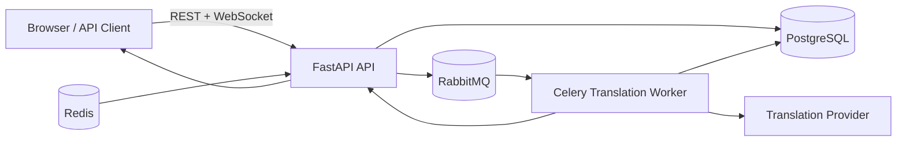

# Architecture Overview

## Objectives

- Preserve chat responsiveness by delivering original messages immediately.
- Perform translation on the server to reduce LLM usage and ensure consistent output per language.
- Support room-based conversations with configurable translation strategy.
- Persist complete message history, including translation updates.
- Preserve core chat functionality during LLM/provider outages by continuing original-message delivery.

## High-Level Architecture

## Runtime Topology

- API container: FastAPI REST + WebSocket gateway + dashboard UI.
- Worker container: Celery consumer for translation jobs.
- Database container: PostgreSQL for durable state, room membership, messages, and translations.
- Queue container: RabbitMQ for durable translation jobs.
- Redis container: currently used for local cache and operational support; multi-instance pub/sub fanout is not yet implemented.

## State Ownership

- PostgreSQL is the source of truth for rooms, membership, messages, translations, and room events.
- Redis is currently used as an auxiliary cache and operational layer rather than the canonical store.
- Redis is not yet acting as the primary authorization or history source.

## Redis Responsibilities

- cache for transient translation or metadata lookups
- local operational support for future presence and rate-limit use cases
- room and request-level normalization helpers for the current single-instance runtime
- future expansion for multi-instance pub/sub and replay support

## Core Architectural Pattern

Event-driven enrichment with a live room timeline:

1. Message is accepted and persisted as original content.
2. Original content is broadcast immediately to room subscribers.
3. Translation jobs are queued for the target-language workflow.
4. Worker computes the required target languages and performs provider translation.
5. Translation rows are persisted and a MessageUpdated event is broadcast for the same message id.
6. The room timeline remains live even when translation is delayed or unavailable.
7. Clients can load recent room history and reconnect with a cursor-safe replay window when they re-enter a room.

The current slice includes reconnect-safe room history for recent messages, while full analytics and multi-instance fanout remain follow-on work.

## Degraded Mode Behavior (LLM Unavailable)

- MessageCreated emission is never blocked by translation availability.
- If translation provider calls fail or time out, chat still delivers and persists the original message.
- Worker records translation failure status and may emit a non-blocking message update indicating translation_unavailable.
- Clients must treat translation as best-effort enrichment on top of guaranteed original-message delivery.

## Delivery Semantics

- Realtime stream: live room fanout to connected clients.
- Message identity: stable message id across original and translated updates.
- Versioning: monotonic message version increment on each server-side update.
- History replay: not yet implemented in the current stage.

## Room Configuration Model

Room admins can configure translation mode:

- low_latency
- balanced
- high_quality

Mode influences prompt profile, model choice, timeout, retry policy, and batching behavior.

## Room Admin Metrics Model

This is planned but not yet implemented in the active codebase:

- translation cost by room and time window
- end-to-end translation delay percentiles
- queue delay and worker processing time
- translation success/failure rate
- per-language volume and cost breakdown

The raw telemetry tables exist in the database model, but the admin metrics APIs and dashboards are still follow-on work.
