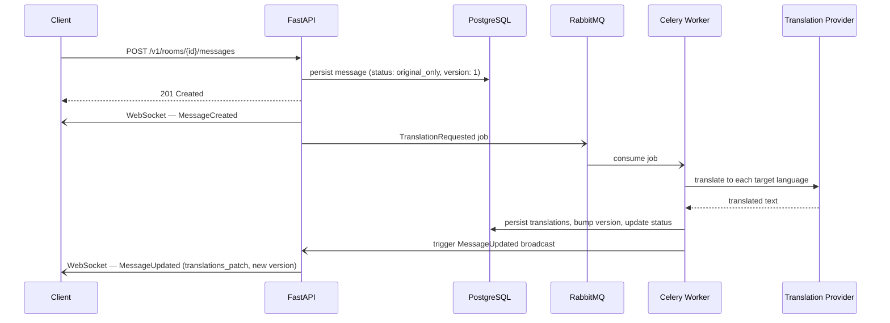

# Data Flow and Contracts

## Message Lifecycle



**Degraded path (provider unavailable):**

Steps 1–5 are unchanged — the message is delivered in the original language before translation starts. The worker retries according to the retry policy. On exhaustion or permanent failure, it marks the message `translation_unavailable` and emits a final `MessageUpdated` with that status. Chat is never blocked.

---

## End-to-End Message Flow (prose)

1. Client calls the REST message endpoint.
2. API validates auth and room membership.
3. API persists the original message with `version = 1` and `status = original_only`.
4. API broadcasts a `MessageCreated` event to all connected room subscribers.
5. API queues a `TranslationRequested` job.
6. Worker computes target languages from room member preferences and translates content.
7. Worker persists translations and updates message version and status.
8. Worker broadcasts a `MessageUpdated` event to the room.
9. Clients patch the existing message in place by `message_id`.

> **Note:** Multi-instance Redis pub/sub fan-out is not yet implemented. The current runtime uses a single API replica with in-process broadcast.

## Event Envelope (Realtime)

```json
{
  "event_id": "evt_01J9...",
  "event_type": "MessageCreated",
  "event_version": 1,
  "occurred_at": "2026-08-05T12:00:00Z",
  "room_id": "room_123",
  "room_sequence": 481,
  "payload": {}
}
```

Rules:

- event_id is globally unique.
- room_sequence is strictly increasing per room.
- Clients deduplicate by event_id.
- Reconnect replay starts after last acknowledged room_sequence.

## Command Contract: SendMessage

```json
{
  "type": "SendMessage",
  "request_id": "req_abc123",
  "room_id": "room_123",
  "client_message_id": "cmsg_001",
  "source_lang": "pl",
  "content_original": "Czesc wszystkim",
  "sent_at": "2026-08-05T12:00:00Z"
}
```

Validation:

- source_lang must be ISO 639-1 supported language.
- content_original max length configurable (example: 4000 chars).
- client_message_id required for idempotency.

## Event Contract: MessageCreated

```json
{
  "event_id": "evt_01J9...",
  "event_type": "MessageCreated",
  "event_version": 1,
  "occurred_at": "2026-08-05T12:00:01Z",
  "room_id": "room_123",
  "room_sequence": 481,
  "type": "MessageCreated",
  "message": {
    "message_id": "msg_1001",
    "version": 1,
    "author_user_id": "user_7",
    "source_lang": "pl",
    "content_original": "Czesc wszystkim",
    "translations": {},
    "status": "original_only",
    "created_at": "2026-08-05T12:00:01Z"
  }
}
```

## Event Contract: MessageUpdated

```json
{
  "event_id": "evt_01JA...",
  "event_type": "MessageUpdated",
  "event_version": 1,
  "occurred_at": "2026-08-05T12:00:02Z",
  "room_id": "room_123",
  "room_sequence": 482,
  "type": "MessageUpdated",
  "message_id": "msg_1001",
  "version": 2,
  "translations_patch": {
    "en": {
      "content": "Hello everyone",
      "provider": "openai",
      "quality_mode": "balanced",
      "translated_at": "2026-08-05T12:00:02Z"
    }
  },
  "status": "partially_translated"
}
```

Possible status values:

- partially_translated
- translated
- translation_unavailable

Rules:

- Same message_id across original and all updates.
- version increases monotonically.
- translations_patch is partial and mergeable.

## REST Contracts

### Create Room

POST /v1/rooms

Request:

```json
{
  "name": "Engineering",
  "default_translation_mode": "balanced"
}
```

### Add Member

POST /v1/rooms/{room_id}/members

Request:

```json
{
  "user_id": "user_9",
  "preferred_lang": "en",
  "role": "member"
}
```

### History

GET /v1/rooms/{room_id}/messages?since_message_id=...&limit=50

Response includes original + known translations + versions.

Rules:

- If `since_message_id` is omitted, the API returns the recent window (`limit`) and orders results oldest-to-newest within that window.
- If `since_message_id` is provided, it must belong to the same room, otherwise the API returns 404.

## Queue Contract: TranslationRequested

RabbitMQ transport metadata:

- exchange: chat.translation
- routing_key: translation.requested
- queue: translation.requested.q
- dead_letter_queue: translation.requested.dlq

```json
{
  "job_id": "job_01",
  "message_id": "msg_1001",
  "room_id": "room_123",
  "source_lang": "pl",
  "content_original": "Czesc wszystkim",
  "room_translation_mode": "balanced",
  "requested_at": "2026-08-05T12:00:01Z"
}
```

## Telemetry Event Contract: TranslationCompleted

Produced by worker after each target-language translation attempt.

```json
{
  "event_type": "TranslationCompleted",
  "room_id": "room_123",
  "message_id": "msg_1001",
  "target_lang": "en",
  "provider": "openai",
  "status": "success",
  "attempt": 1,
  "queue_delay_ms": 120,
  "provider_latency_ms": 840,
  "end_to_end_delay_ms": 1280,
  "input_tokens": 48,
  "output_tokens": 14,
  "estimated_cost_usd": 0.00072,
  "occurred_at": "2026-08-05T12:00:02Z"
}
```

Notes:

- status can be success or failed.
- estimated_cost_usd must be computed by the same pricing table version used by workers.
- Failed events should still include delay fields when available.

Failure semantics:

- TranslationCompleted with status failed does not imply message send failure.
- Original message delivery is successful if MessageCreated was emitted.

## Idempotency and Concurrency

- Unique constraint: (room_id, author_user_id, client_message_id).
- Worker idempotency key: (message_id, target_lang).
- Optimistic concurrency: update by message_id and expected version.

Redis dedup conventions:

- dedup:request:{request_id} with short TTL to prevent immediate command duplicates.
- dedup:event:{event_id} with short TTL to protect websocket replay loops.

## Redis Cache Contracts

Recommended key patterns:

- room:meta:{room_id}
- room:members:{room_id}
- presence:user:{user_id}
- translation:cache:{hash}
- rate_limit:{scope}:{id}
- room:analytics:{room_id}:{window}:{bucket}

TTL guidance:

- room:meta and room:members: 60 to 300 seconds.
- presence:user: 30 to 90 seconds.
- translation:cache: 1 to 24 hours.
- rate_limit and dedup keys: policy-specific short windows.
- room:analytics: 15 to 120 seconds depending on dashboard freshness target.

## Admin Metrics API Contracts

### Room Metrics Summary

GET /v1/admin/rooms/{room_id}/metrics/summary?from=...&to=...

Response:

```json
{
  "room_id": "room_123",
  "window": {
    "from": "2026-08-05T00:00:00Z",
    "to": "2026-08-05T23:59:59Z"
  },
  "totals": {
    "messages": 1240,
    "translations": 3190,
    "success_rate": 0.992,
    "estimated_cost_usd": 5.43
  },
  "latency_ms": {
    "queue_p50": 85,
    "queue_p95": 240,
    "provider_p50": 620,
    "provider_p95": 1320,
    "end_to_end_p50": 910,
    "end_to_end_p95": 1880
  }
}
```

### Room Metrics by Language Pair

GET /v1/admin/rooms/{room_id}/metrics/languages?from=...&to=...

Response includes per pair volume, cost, and latency percentiles.

## Error Contracts

Realtime errors should be explicit and machine-readable:

```json
{
  "type": "Error",
  "code": "ROOM_FORBIDDEN",
  "message": "User is not a room member",
  "request_id": "req_abc123"
}
```

Suggested codes:

- AUTH_INVALID
- ROOM_NOT_FOUND
- ROOM_FORBIDDEN
- PAYLOAD_INVALID
- MESSAGE_TOO_LARGE
- TRANSLATION_FAILED
- RATE_LIMITED
